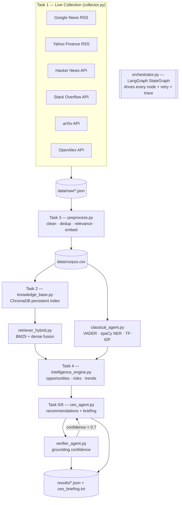

# AI CEO — Strategic Intelligence Agent

An AI Strategy Consultant for a chosen public company (default: **Apple, AAPL**).
It **collects live public information**, builds a **knowledge repository**, runs a
**strategic intelligence engine** (opportunities / risks / trends), and produces
**evidence-based executive recommendations** plus a **CEO briefing** answering:

> *"If you were the CEO today, what would you do next and why?"*

Every component maps to a course module (see [Module map](#module-map)) so the
solution is fully explainable in the oral exam and easy to extend during live coding.

---

## System architecture



## Data flow

```
sources ──HTTP──> data/raw/*.json ──clean/dedup/relevance──> data/corpus.csv
        │                                                          │
        │                                              embed (all-MiniLM-L6-v2)
        │                                                          ▼
        │                                               data/chroma/ (ChromaDB)
        ▼                                                          │
   uniform record                                    hybrid retrieve (BM25 + dense)
 {id,title,text,source,                                            │
  source_type,url,date}                              LLM reason (Llama-3.1-8B)
                                                                   ▼
                              opportunities / risks / trends ─> recommendations ─> verify ─> briefing
                                                                   ▼
                                                            results/*.json
```

## Technology stack

| Layer | Choice | Why |
|---|---|---|
| Env / deps | **uv** (`.venv`) | reproducible, fast |
| Collection | `feedparser`, `requests` | free public RSS/JSON APIs, no keys |
| Sources (≥3 required) | News, Finance, Community (HN + Stack Overflow), Research (arXiv + OpenAlex) | 4 independent source types |
| Storage / index | **ChromaDB** (persistent) | Task 2, Module 10 |
| Embeddings | `sentence-transformers/all-MiniLM-L6-v2` | PDF-recommended, light |
| Retrieval | **Hybrid** BM25 (`rank_bm25`) + dense cosine | Module 10 Task 3 fusion |
| Classical NLP | `nltk` VADER · `spaCy` NER · `sklearn` TF-IDF | Modules 2/3/9 |
| Reasoning LLM | **Llama-3.1-8B-Instruct** via HF Inference (free); local `Qwen2.5-0.5B` fallback | PDF rule: open/free only — **no paid API** |
| Verifier | SBERT cosine grounding (+ optional `bart-large-mnli` NLI) | MiniHackathon verifier |
| Orchestration | **LangGraph** `StateGraph` | Module 11 |
| Dashboard | Streamlit (planned, Deliverable 2) | PDF example |

## AI pipeline

1. **Collect** — `collect_all()` pulls live docs from 6 endpoints into a uniform shape.
2. **Process** — clean (HTML unescape/strip), drop <5-word docs, keep only docs that
   mention the company (by alias, whole-word) or a competitor, de-duplicate by id + title.
3. **Index** — embed each doc and store in a persistent Chroma collection.
4. **Retrieve** — per strategic theme, fuse BM25 + dense scores (`alpha=0.5`) → top-k cited evidence.
5. **Reason** — the LLM extracts opportunities / risks / trends grounded *only* in retrieved evidence.
6. **Recommend** — convert the strongest signals into Task-6 recommendations
   (action, evidence, expected impact, risk, priority).
7. **Verify** — score each recommendation's grounding (SBERT cosine); if mean confidence
   `< 0.7`, the LangGraph loop retries the recommendation node once.
8. **Brief** — generate the CEO briefing (*what happened / why it matters / what to do next*).
9. **Persist** — write `results/*.json`, `ceo_briefing.txt`, and `dashboard_data.json`.

## Design decisions

- **Config-driven company switch.** Company identity lives in `config.py`
  (`COMPANY`, `TICKER`, `COMPETITORS`, `COMPANY_ALIASES`); collection queries live in
  `collector.py`. Switching company = edit those + rerun. Built for live-coding changes.
- **Generic-name safety.** Names like *Apple* are matched as **whole-word aliases**
  (`iPhone`, `AAPL`, `Tim Cook`, …) so the relevance filter never keeps *pineapple* / *apple pie*.
- **Uniform document shape** across all sources → the rest of the pipeline is source-agnostic.
- **Open-source LLM only**, selected at runtime: self-hosted server → HF Inference → local fallback.
  Never depends on a paid API (PDF "Not Allowed").
- **Evidence-first.** Every signal and recommendation carries cited `[src-#]` evidence;
  the verifier rejects ungrounded claims.

## Module map

| Pipeline file | PDF task | Course source |
|---|---|---|
| `collector.py` | 1 Live collection | new (repo ships CSVs, no scraper) |
| `knowledge_base.py` | 2 Knowledge repo | Module 10 (Chroma) |
| `preprocess.py` | 3 Processing | Modules 2, 3 |
| `retriever_hybrid.py` | retrieval | Module 10 Task 3, MiniHackathon |
| `classical_agent.py` | NER / sentiment / TF-IDF | Modules 2, 3, 9 |
| `intelligence_engine.py` | 4 Intelligence | Modules 6, 9, 10 |
| `ceo_agent.py` | 5/6 Recommendations | Module 11 |
| `verifier_agent.py` | 6 Verification | MiniHackathon verifier |
| `orchestrator.py` | orchestration | Module 11 LangGraph |

## Run

```bash
uv sync                              # install deps
uv run python -m spacy download en_core_web_sm   # one-time, for NER
cp .env.example .env                 # add a free HUGGINGFACEHUB_API_TOKEN (optional)

uv run python main.py collect        # Task 1 only  -> data/raw/*.json
uv run python main.py corpus         # Task 3 only  -> data/corpus.csv
uv run python main.py index          # Task 2 only  -> data/chroma/
uv run python main.py                # full LangGraph pipeline -> results/
```

## Outputs (`results/`)

| File | Contents |
|---|---|
| `intelligence.json` | opportunities, risks, trends, competitor activity, keywords |
| `recommendations.json` | recs with evidence / impact / risk / priority / confidence |
| `metrics.json` | verifier confidence + factual precision |
| `trace.json` | LangGraph execution trace |
| `ceo_briefing.txt` | what happened / why it matters / what to do next |
| `dashboard_data.json` | assembled payload for the (planned) Streamlit dashboard |
