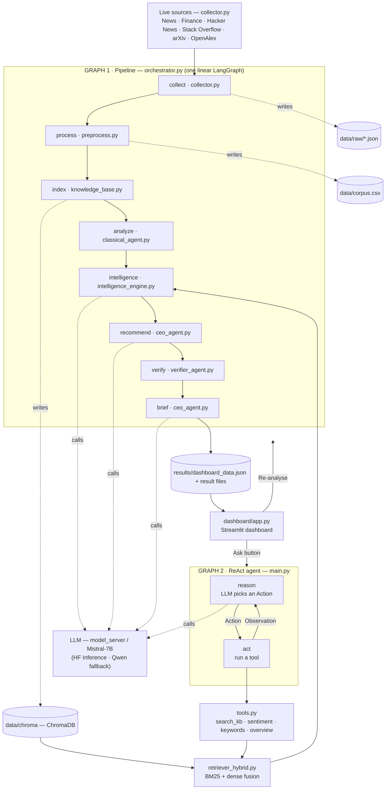

# AI Strategy Consultant — Strategic Intelligence Agent

An AI Strategy Consultant for a chosen public company (default: **Tesla, TSLA**).
It **collects live public information**, builds a **knowledge repository**, runs a
**strategic intelligence engine** (opportunities / risks / trends), and produces
**evidence-based executive recommendations** plus a **CEO briefing** answering:

> *"If you were the CEO today, what would you do next and why?"*

Two front doors:

- **`main.py`** — a LangGraph **ReAct agent**: the LLM decides which tool to call,
  fetches real cited evidence, and answers any strategic question.
- **`dashboard/app.py`** — a **Streamlit Executive Intelligence Dashboard** with all
  seven required sections (Overview, Market Intelligence, Opportunities, Risks,
  Trends, Sentiment, Recommendations, Briefing) plus an interactive *Ask the CEO* tab.

---

## System architecture

The whole system is just **two graphs**: one linear **pipeline** (the deterministic
deliverables) and the **ReAct agent loop** (interactive Q&A). Everything else is a plain
stage function or an agent tool.



## Data flow

```
sources ──HTTP──> data/raw/*.json ──clean/dedup/relevance──> data/corpus.csv
        │                                                          │
        │                                              embed (all-MiniLM-L6-v2)
        │                                                          ▼
        │                                               data/chroma/ (ChromaDB)
        ▼                                                          │
   uniform record                                    hybrid retrieve (BM25 + dense, alpha=0.5)
 {id,title,text,source,                                            │
  source_type,url,date}                       LLM reason (Mistral-7B-Instruct, model_server)
                                                                   ▼
                              opportunities / risks / trends ─> recommendations ─> verify ─> briefing
                                                                   ▼
                                          results/*.json + dashboard_data.json ─> Streamlit dashboard
```

## Technology stack

| Layer | Choice | Why |
|---|---|---|
| Env / deps | **uv** (`.venv`, `pyproject.toml`) | reproducible, fast |
| Collection | `feedparser`, `requests` | free public RSS/JSON APIs, no keys |
| Sources (≥3 required) | News, Finance, Community (HN + Stack Overflow), Research (arXiv + OpenAlex) | **4 independent source types**, ~399 docs (≥100) |
| Storage / index | **ChromaDB** (persistent, cosine) | Task 2, Module 10 |
| Embeddings | `sentence-transformers/all-MiniLM-L6-v2` | PDF-recommended, light |
| Retrieval | **Hybrid** BM25 (`rank_bm25`) + dense cosine, min-max fused | Module 10 Task 3 fusion |
| Classical NLP | **RoBERTa / TweetEval** 3-class sentiment (`transformers` pipeline) · `scikit-learn` TF-IDF keywords | Modules 3/9b — TweetEval (neg/neutral/pos) is the taught sentiment task; deterministic (greedy) |
| Reasoning LLM | **Mistral-7B-Instruct-v0.3** via self-hosted `model_server/` (OpenAI-compatible); HF Inference then local `Qwen2.5-0.5B` as fallbacks | PDF rule: open/free only — **no paid API** |
| LLM serving | `model_server/server.py` (FastAPI) on a GPU box, exposed via **cloudflared** tunnel | run a strong open model with no local GPU |
| Verifier | SBERT cosine grounding vs evidence | MiniHackathon verifier |
| Orchestration | **LangGraph** `StateGraph` (one linear pipeline graph) | Module 11 |
| Agent | **LangGraph ReAct** loop, tool-calling (`src/tools.py`) | Module 11 |
| Dashboard | **Streamlit** (`dashboard/app.py`) | PDF example, Deliverable 2 |

## AI pipeline

1. **Collect** — `collect_all()` pulls live docs from 6 endpoints (4 source types) into a uniform shape.
2. **Process** — clean (HTML unescape/strip, whitespace), drop <5-word docs, keep only docs that
   mention the company (by whole-word alias) or a competitor, de-duplicate by id + normalised title,
   cap 120 docs per source type for balance.
3. **Index** — embed each doc (`all-MiniLM-L6-v2`) and store in a persistent Chroma collection.
4. **Retrieve** — per strategic theme, min-max normalise and fuse BM25 + dense scores
   (`score = 0.5·dense + 0.5·sparse`) → top-k cited evidence (`[src-#]`).
5. **Reason** — the LLM extracts opportunities / risks / trends grounded *only* in retrieved evidence.
6. **Recommend** — convert the strongest signals into Task-6 recommendations
   (action, supporting evidence, expected impact, **risk assessment**, priority, risk level).
7. **Verify** — score each recommendation's grounding (SBERT cosine vs evidence); blend with retrieval
   confidence and flag any recommendation below `0.7` as unverified (drives the factual-precision metric).
8. **Brief** — generate the CEO briefing (*what happened / why it matters / what to do next*).
9. **Persist** — write `results/*.json`, `ceo_briefing.txt`, and `dashboard_data.json`.
10. **Serve** — Streamlit renders `dashboard_data.json` across all 7 sections; the *Ask the CEO* tab
    runs the ReAct agent live and re-runs the analysis so every tab refreshes from the same evidence.

## Dashboard (Deliverable 2)

`dashboard/app.py` — Streamlit, ten tabs mapping 1:1 to the PDF sections:

| Tab | PDF section | Shows |
|---|---|---|
| Ask the Consultant | Task 5 | live ReAct agent: answer + tool-call trace + strategic options + follow-ups |
| Overview | §1 Company Overview | name, industry, #docs, #sources, last update, source-mix pie |
| (Overview) | §2 Market Intelligence | recent news, competitor activity, **emerging technologies**, **company announcements**, trending keywords |
| Opportunities | §3 Opportunity Monitor | title, impact level, evidence, confidence |
| Risks | §4 Risk Monitor | title, category, severity, evidence, confidence, severity pie |
| **Trends** | Task 4 Trends | emerging trends **grouped by lens** (Technology / Customer behaviour / Industry) + confidence + evidence + **signal-strength bar chart** |
| Sentiment | §5 Sentiment | news / public / overall (RoBERTa, 3-class TweetEval), distribution pie, **monthly trend line** |
| Recommendations | §6 | recommendation, priority, evidence, expected impact, risk assessment, risk level |
| Briefing | §7 CEO Briefing | what happened / why it matters / what to do next |
| Retrieval | — | hybrid RAG explorer (dense / sparse / fused scores) |
| Activity | — | every question saved with a full dashboard snapshot to replay |

Run it:

```bash
uv run streamlit run dashboard/app.py
```

The sidebar **Re-analyse now** / **Collect fresh data + re-analyse** buttons rebuild the
corpus and refresh every tab. Requires the LLM (see `.env`) to be reachable.

## Design decisions

- **Config-driven company switch.** Company identity lives in `config.py`
  (`COMPANY`, `TICKER`, `COMPETITORS`, `COMPANY_ALIASES`); collection queries live in
  `collector.py`. Switching company = edit those + rerun. Built for live-coding changes.
- **Generic-name safety.** "Tesla" is also a physics unit / a person, so aliases are matched
  as **whole words** (`TSLA`, `Model 3`, `Cybertruck`, `Gigafactory`, `Powerwall`, …) and the
  relevance filter drops docs that don't mention the company or a tracked competitor.
- **Uniform document shape** across all sources → the rest of the pipeline is source-agnostic.
- **Open-source LLM only**, selected at runtime: self-hosted `model_server` (Mistral-7B) →
  HF Inference → local Qwen fallback. Never depends on a paid API (PDF "Not Allowed").
- **Two graphs, that's it.** One linear pipeline graph (`collect→process→index→analyze→
  intelligence→recommend→verify→brief`) and the ReAct agent loop. `run_analyze()` runs just the
  `analyze…brief` tail of the same pipeline (reusing the index) so refreshes never re-collect.
- **Evidence-first.** Every signal and recommendation carries cited `[src-#]` evidence; the
  verifier scores grounding and flags weakly-grounded recommendations (confidence < 0.7).

## Module map

| Pipeline file | PDF task | Course source |
|---|---|---|
| `collector.py` | 1 Live collection | new (6 free public endpoints) |
| `knowledge_base.py` | 2 Knowledge repo | Module 10 (Chroma) |
| `preprocess.py` | 3 Processing | Modules 2, 3 |
| `retriever_hybrid.py` | retrieval | Module 10 Task 3, MiniHackathon |
| `classical_agent.py` | sentiment / TF-IDF | Modules 3, 9 |
| `intelligence_engine.py` | 4 Intelligence | Modules 6, 9, 10 |
| `ceo_agent.py` | 5/6 Recommendations | Module 11 |
| `verifier_agent.py` | 6 Verification | MiniHackathon verifier |
| `tools.py` + `main.py` | 5 Agent | Module 11 ReAct |
| `orchestrator.py` | orchestration | Module 11 LangGraph |
| `dashboard/app.py` | Deliverable 2 | Streamlit |

## Run

```bash
uv sync                              # install deps (pyproject.toml)
cp .env.example .env                 # set MODEL_SERVER_URL (recommended) or HUGGINGFACEHUB_API_TOKEN

# --- pipeline (deterministic deliverables) ---
uv run python main.py ingest         # Task 1-3: collect -> corpus -> Chroma index  (slow, run rarely)
uv run python main.py report         # Task 4-7: reuse index -> results/*.json + dashboard_data.json

# --- the agent (Task 5) ---
uv run python main.py                       # default CEO question
uv run python main.py ask "How do we beat BYD in China?"
uv run python main.py chat                  # interactive loop

# --- single ingest stages ---
uv run python main.py collect        # Task 1 only  -> data/raw/*.json
uv run python main.py corpus         # Task 3 only  -> data/corpus.csv
uv run python main.py index          # Task 2 only  -> data/chroma/

# --- dashboard (Deliverable 2) ---
uv run streamlit run dashboard/app.py
```

### LLM server (recommended for the exam)

The strong open model runs in `model_server/` (FastAPI, OpenAI-compatible) on a GPU box and is
reached over HTTP via a **cloudflared** tunnel. Set its public URL as `MODEL_SERVER_URL` in `.env`.
See `model_server/README.md`. If no server/token is set, the pipeline still runs on the local
`Qwen2.5-0.5B` fallback (weak but offline).

## Outputs (`results/`)

| File | Contents |
|---|---|
| `intelligence.json` | opportunities, risks, trends, competitor activity, keywords |
| `recommendations.json` | recs with evidence / impact / risk assessment / priority / confidence |
| `metrics.json` | verifier mean confidence + factual precision |
| `ceo_briefing.txt` | what happened / why it matters / what to do next |
| `dashboard_data.json` | assembled payload rendered by the Streamlit dashboard |
| `activity.json` | dashboard Q&A log with per-question snapshots |
